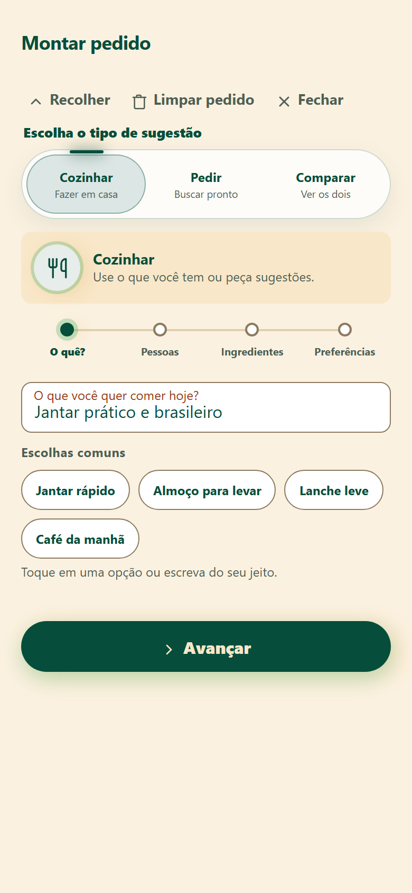
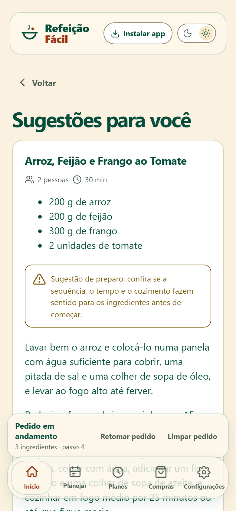
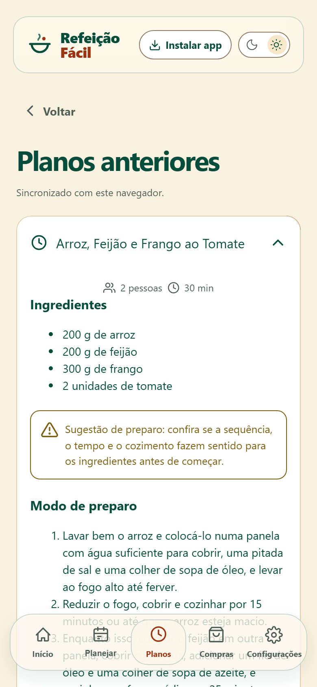
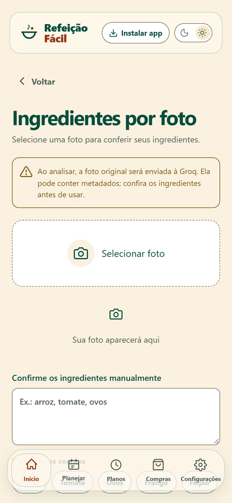
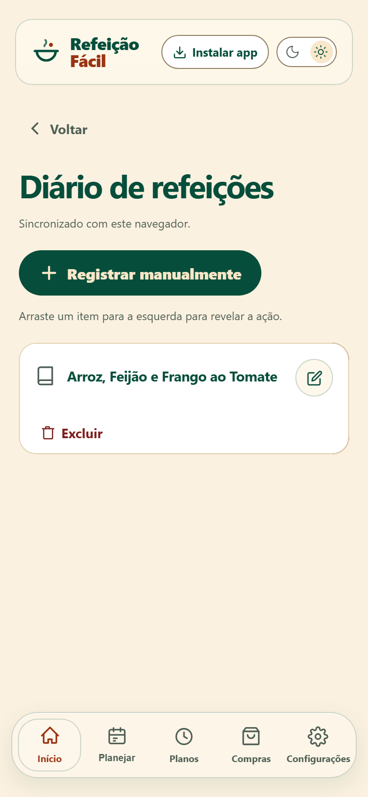

<p align="center">
  
</p>

# Refeição Fácil

**Sua próxima refeição, resolvida.**

O Refeição Fácil é um PWA de planejamento de refeições que transforma tempo, orçamento, número de pessoas, ingredientes disponíveis e preferências em sugestões estruturadas. O aplicativo também reúne planos salvos, despensa, lista de compras, diário, avaliações e um cartão semanal compartilhável.

Projeto de portfólio desenvolvido por Renê Guimarães, com frontend React/TypeScript e backend serverless na Cloudflare.

## Demonstração

<p align="center">
  <a href="https://planejador-refeicoes-ia.pages.dev/demonstracao/"><strong>Abrir o tour interativo das telas</strong></a>
  &nbsp;·&nbsp;
  <a href="public/demo/refeicao-facil-demo.webm"><strong>Assistir ao vídeo vertical</strong></a>
</p>

<table>
  <tr>
    <td align="center"><br><strong>Início</strong></td>
    <td align="center"><br><strong>Pedido guiado</strong></td>
    <td align="center"><br><strong>Sugestões por IA</strong></td>
  </tr>
  <tr>
    <td align="center"><br><strong>Planos completos</strong></td>
    <td align="center"><br><strong>Ingredientes por foto</strong></td>
    <td align="center"><br><strong>Diário</strong></td>
  </tr>
</table>

As onze capturas móveis ficam em [`public/demo/screens`](public/demo/screens). Elas foram geradas numa sessão isolada, com conteúdo fictício e sem dados pessoais. O carrossel reutilizável está em [`components/ui/phone-mockups-1.tsx`](components/ui/phone-mockups-1.tsx); para atualizar imagens e vídeo depois de mudanças visuais, execute:

```sh
npm run demo:capture
npm run demo:video
```

## Estado do projeto

O fluxo principal está publicado e funcional em produção:

- **Aplicação:** [planejador-refeicoes-ia.pages.dev](https://planejador-refeicoes-ia.pages.dev/)
- **Produção:** sessões, geração por IA, análise de foto, personalização, diário, despensa, histórico e exclusão habilitados.
- **Preview:** ambiente separado, com banco D1 e configuração próprios.
- **Busca de vídeo pela API do YouTube:** desabilitada enquanto não houver `YOUTUBE_API_KEY`; a interface mantém a pesquisa direta no YouTube como alternativa.
- **Última validação manual:** geração completa confirmada no PWA em celular. O navegador interno usado durante a validação apresentou uma inconsistência isolada de atualização visual após a resposta, embora o backend tenha concluído e salvado o plano corretamente.

## Funcionalidades

### Planejamento

- Escolha entre cozinhar e procurar comida pronta.
- Pedido guiado em etapas, com sugestões comuns para evitar formulários vazios.
- De 1 a 20 pessoas.
- Tempo disponível de até 2 horas.
- Orçamento opcional com incrementos rápidos.
- Ingredientes opcionais, digitados ou selecionados a partir da despensa.
- Preferências opcionais, como pouca louça, mais proteína, vegetariano e sem fritura.
- Três sugestões por geração, dentro de uma única chamada à IA.
- Ingredientes, quantidades, tempo, modo de preparo e avisos de conferência preservados no plano.

### Foto de ingredientes

- Captura pela câmera ou envio de JPEG, PNG e WebP.
- Reconhecimento por modelo multimodal da Groq.
- Lista reconhecida editável e sujeita à confirmação humana antes da geração.
- A imagem é processada de forma transitória e não é armazenada no D1.

### Planos, diário e avaliação

- Planos gerados ficam disponíveis na sessão do visitante.
- A ação **Comi isso** registra somente a opção selecionada.
- Refeições consumidas entram no diário e ficam ligadas ao plano de origem.
- Avaliação de 1 a 5 pratos, com alteração ou remoção posterior.
- Registro manual de refeição também disponível.
- Exclusão individual de planos e registros com bloqueio contra cliques duplicados.

### Despensa e compras

- Cadastro, edição e baixa de itens da despensa.
- Itens cadastrados aparecem como sugestões no planejamento.
- Uso opcional da despensa como contexto da geração.
- Prévia e confirmação da baixa dos ingredientes consumidos.
- Lista de compras mantida separadamente da despensa.

### Personalização e compartilhamento

- Consentimentos independentes para usar histórico e despensa nas próximas gerações.
- Exclusão dos dados de produto da sessão.
- Resumo dos últimos sete dias.
- Cartão semanal com opções de composição, prévia e compartilhamento como imagem.
- Temas claro e escuro; no escuro, identidade em verde e preto.

### PWA

- Manifesto, ícones normal e maskable e instalação na tela inicial.
- Service worker para o shell estático e experiência resiliente.
- Navegação mobile com cinco áreas: Início, Planejar, Planos, Compras e Configurações.
- Layout responsivo e componentes acessíveis por teclado.

## Arquitetura

| Camada | Tecnologia | Responsabilidade |
| --- | --- | --- |
| Interface | React 19, TypeScript, Tailwind CSS 4, Vite | Telas, componentes, temas, animações e estado da interface |
| Componentes | Estrutura shadcn em `components/ui` | Elementos reutilizáveis e utilitário `cn` em `lib/utils.ts` |
| Backend | Cloudflare Pages Functions | API no mesmo domínio da interface |
| Banco | Cloudflare D1 | Sessões, preferências, planos, diário, despensa, cotas e recibos técnicos |
| IA de texto | Groq, `openai/gpt-oss-20b` | Sugestões estruturadas de refeições |
| IA visual | Groq, modelo multimodal configurado pelo servidor | Identificação assistida de ingredientes |
| Vídeo | Pesquisa direta no YouTube; integração de API opcional | Apoio em vídeo sem bloquear o uso da receita |
| Hospedagem | Cloudflare Pages | PWA e Functions publicados conjuntamente |
| CI | GitHub Actions | Testes, integração e build em cada alteração |

O backend permanece no mesmo domínio do PWA para simplificar cookies seguros e evitar comunicação entre origens. Produção e preview usam bancos D1 e segredos separados.

## Estrutura principal

```text
components/ui/       componentes React reutilizáveis
frontend/            telas, navegação, cliente da API e estilos-fonte
functions/api/       rotas do Cloudflare Pages Functions
lib/                 utilitários compartilhados da interface
migrations/          migrações versionadas do D1
public/              build publicado, manifesto e service worker
scripts/             verificações de integração e sondas controladas
src/                 contratos, domínio, segurança e provedores
tests/               testes automatizados
docs/                decisões, contratos, segurança e operação
```

## Executar localmente

### Requisitos

- Node.js 22 ou superior.
- npm.

### Instalação

```sh
npm ci
npm run db:migrate:local
npm run dev
```

O comando `npm run dev` compila a interface e inicia o Wrangler Pages Dev. Use o endereço informado no terminal — normalmente `http://127.0.0.1:8788` — para testar frontend e API juntos.

O banco local fica em `.wrangler/` e não é versionado. O ID zerado da configuração raiz é apenas um marcador para desenvolvimento local.

Para acompanhar somente a compilação da interface durante ajustes visuais:

```sh
npm run dev:ui
```

Para uma prévia estática da interface, sem equivaler ao backend completo:

```sh
npm run preview:ui
```

## Configuração

Copie `.dev.vars.example` para `.dev.vars` apenas no ambiente local e preencha os valores privados. Nunca envie `.dev.vars`, chaves ou cookies ao Git.

Segredos usados pelo servidor:

| Variável | Finalidade |
| --- | --- |
| `GROQ_API_KEY` | Autenticação dos modelos de texto e visão |
| `SESSION_SECRET` | Proteção criptográfica das sessões; mínimo de 32 caracteres |
| `IP_HASH_SECRET` | HMAC dos identificadores de rede; mínimo de 32 caracteres |
| `YOUTUBE_API_KEY` | Opcional; habilita a busca de apoio pela API do YouTube |

As flags e políticas não secretas ficam em `wrangler.jsonc`. Os ambientes `production` e `preview` possuem blocos próprios. Alterar um segredo no painel ou via Wrangler é uma operação de deploy e deve ser feito separadamente por ambiente.

### Recursos e flags

- `AI_ENABLED`
- `SESSIONS_ENABLED`
- `VISION_ENABLED`
- `PERSONALIZATION_ENABLED`
- `DIARY_ENABLED`
- `PANTRY_ENABLED`
- `HISTORY_DELETION_ENABLED`
- `VIDEO_ENABLED`

`/api/health` informa a disponibilidade operacional sem revelar o valor dos segredos. Antes de produção pública definitiva, revise a quantidade de detalhes expostos por essa rota conforme [a revisão de segurança](docs/HEALTH-SECURITY-REVIEW.md).

## Cotas atuais da demo

As cotas são aplicadas no servidor por visitante, rede e projeto, com janelas diária e por minuto. Reservas são atômicas no D1 e uma repetição com a mesma chave de idempotência não inicia outra chamada à IA.

| Operação | Visitante/dia | Rede/dia | Projeto/dia | Reserva por tentativa |
| --- | ---: | ---: | ---: | ---: |
| Geração de refeições | 5 | 24 | 60 | 6.144 tokens |
| Análise de foto | 2 | 8 | 10 | 4.096 tokens |

Gerar três opções em uma resposta conta como **uma geração**, não três. Uma reserva protege o teto antes da chamada; os tokens efetivos são registrados ao término. Limites podem ser recalibrados sem mudar o contrato do frontend.

## Banco e migrações

O esquema é construído por oito migrações em `migrations/`:

1. visitantes, preferências, planos, diário e contadores;
2. reservas atômicas de uso;
3. histórico e recuperação idempotente de planos;
4. modelo completo do diário;
5. despensa;
6. exclusão e revisão do histórico;
7. cache e cotas de vídeo;
8. avaliações das refeições.

Aplicação local:

```sh
npm run db:migrate:local
```

Ambientes remotos devem ser inspecionados antes de qualquer aplicação. Exemplo de verificação:

```sh
npx wrangler d1 migrations list DB --env preview --remote
npx wrangler d1 migrations list DB --env production --remote
```

Não aplique migração remota automaticamente durante `npm install`, build ou testes.

## API

As rotas principais são:

| Rota | Uso |
| --- | --- |
| `GET /api/health` | Estado operacional das dependências e flags |
| `POST /api/session` | Criar ou validar a sessão do visitante |
| `GET /api/bootstrap` | Carregar o estado inicial da interface em uma requisição |
| `POST /api/generate` | Gerar sugestões e salvar o plano |
| `POST /api/analyze-ingredients` | Reconhecer ingredientes em uma foto |
| `GET /api/plans` | Listar planos da sessão |
| `DELETE /api/plans/:id` | Excluir um plano |
| `GET/POST /api/meal-logs` | Listar ou registrar refeições consumidas |
| `GET/PUT/DELETE /api/meal-logs/:id` | Consultar, avaliar, editar ou excluir um registro |
| `GET/POST /api/pantry` | Listar ou cadastrar itens da despensa |
| `GET/PUT/DELETE /api/pantry/:id` | Consultar, editar ou excluir um item |
| `GET/POST /api/meal-logs/:id/pantry-deduction` | Pré-visualizar ou aplicar baixa da despensa |
| `GET/PUT /api/preferences` | Ler ou atualizar consentimentos |
| `DELETE /api/history` | Excluir dados do produto da sessão |
| `POST /api/video` | Buscar apoio em vídeo quando a integração estiver habilitada |

Mutações exigem mesma origem, sessão válida e `Idempotency-Key`. A API usa respostas genéricas para o cliente e códigos técnicos distintos nos logs do servidor.

## Segurança e privacidade

- Cookie de sessão `HttpOnly`, `Secure` e `SameSite`.
- Token de sessão aleatório; somente seu hash protegido é persistido.
- Identificador de rede derivado por HMAC, sem armazenar IP puro.
- Validação estrita de corpos, tamanhos, MIME, chaves e saídas dos modelos.
- Cotas com comportamento fail-closed quando configuração, rede ou banco não podem ser validados.
- Redirecionamentos externos tratados manualmente para não encaminhar `Authorization` a outro host.
- Fotos não são persistidas no D1.
- Logs operacionais não incluem pedidos, receitas, fotos, cookies, IPs ou chaves.
- Histórico e despensa só entram no contexto da IA mediante consentimento explícito.
- Exclusão do produto não apaga recibos técnicos necessários para impedir abuso e repetição gratuita.

O aplicativo não oferece diagnóstico médico, prescrição nutricional ou garantia de segurança alimentar. Não informe alergias, doenças ou outros dados sensíveis nos campos livres. Quantidades, preços e tempos são estimativas e devem ser conferidos antes do preparo.

## Testes e qualidade

```sh
npm test
npm run test:integration
npm run build
```

- `npm test`: testes unitários e de contrato com o runner nativo do Node.
- `npm run test:integration`: cenários completos das rotas e invariantes de segurança.
- `npm run build`: TypeScript, Vite, validação sintática das Functions e build do Pages.

Os testes padrão não chamam a Groq nem consomem cota real. Sondas presentes em `scripts/` exigem autorização explícita, segredo privado e ambiente escolhido conscientemente.

## Deploy e operação

- `main` publica o ambiente de produção pelo projeto Cloudflare Pages.
- Branches publicadas geram deployments de preview.
- Preview e produção não compartilham D1 nem segredos.
- Segredos são configurados no ambiente da Cloudflare e nunca no repositório.
- A promoção deve ocorrer somente após testes automatizados, smoke test no preview e conferência das migrações.

Para acompanhar logs de uma Function do Pages em tempo real:

```sh
npx wrangler pages deployment tail --project-name planejador-refeicoes-ia --environment production --format pretty --search ai
```

Troque `production` por `preview` para observar a branch de homologação. Os eventos `ai_operation` registram operação, resultado, código, duração e tokens agregados, sem conteúdo pessoal.

## Limitações conhecidas

- O visitante não possui conta: a continuidade depende do cookie daquele navegador e expira conforme a política da sessão.
- Não há sincronização de histórico entre dispositivos.
- Não existe integração com delivery nem confirmação de preço/disponibilidade em restaurantes.
- A busca direta no YouTube funciona; a API de vídeo permanece desativada sem chave própria.
- Reconhecimento visual pode errar e sempre exige revisão humana.
- A aplicação não calcula calorias ou nutrientes; uma versão futura deve usar fonte alimentar identificada, não estimativa do modelo.
- A disponibilidade depende das camadas gratuitas e dos limites dos provedores. Não há migração automática para plano pago.

## Documentação complementar

- [Configuração](docs/SETUP.md)
- [Contrato de geração](docs/GENERATION-CONTRACT.md)
- [Sessões](docs/SESSIONS.md)
- [Histórico de planos](docs/PLAN-HISTORY.md)
- [Diário](docs/MEAL-LOGS.md)
- [Avaliações](docs/MEAL-RATINGS.md)
- [Despensa](docs/PANTRY.md)
- [Personalização](docs/PERSONALIZATION.md)
- [Exclusão de histórico](docs/HISTORY-DELETION.md)
- [Análise de imagem](docs/IMAGE-ANALYSIS-CONTRACT.md)
- [Vídeo](docs/VIDEO-SETUP.md)
- [Incidente de redirecionamento](docs/REDIRECT-INCIDENT.md)
- [Checklist operacional](docs/CHECKLIST.md)

## Referências técnicas

- [Cloudflare Pages Functions](https://developers.cloudflare.com/pages/functions/)
- [Cloudflare D1](https://developers.cloudflare.com/d1/)
- [Wrangler](https://developers.cloudflare.com/workers/wrangler/)
- [Groq API](https://console.groq.com/docs/overview)

## Autoria e licença

Desenvolvido por **Renê Guimarães**.

A licença de distribuição ainda não foi definida. Até que um arquivo `LICENSE` seja adicionado, o código não deve ser presumido como software livre.

Identidade visual: [conceito e origem da marca](docs/brand/README.md).
